# Clash of Planes

Мультиплеєрна браузерна гра в реальному часі (тема — біплани). Навчальний проєкт курсу «Програмування мовою JavaScript».
Цей репозиторій містить **Lab 01** (тег `lab-01`), **Lab 02** (тег `lab-02`) і **Lab 03** (тег `lab-03`): корабель на canvas
у фіксованому кроці симуляції 60 Гц (Lab 1), об'єктна модель сутностей — кулі, астероїди, зіткнення, pickup'и (Lab 2),
і асинхронний старт гри: завантаження ассетів з прогрес-баром, спрайти, звук через Web Audio, лобі з кімнатами (Lab 3).

## Запуск

```bash
nvm use            # Node 22 (.nvmrc)
npm install
npm run dev        # http://localhost:5173  (loading → лобі → гра)
npm test           # юніт-тести (node:test)
npm run lint
npm run assets     # перегенерувати спрайтшит, звуки й manifest.json (public/assets/)
```

Керування: `←/→` або `A/D` — поворот, `↑` або `W` — тяга, `Space` — вогонь, `R` — скинути корабель,
`M` — вимкнути/увімкнути звук, `Esc` на екрані завантаження — скасувати, `T` — скриптований забіг на 5 с (Lab 1, `?exp=variable`).

Службові сторінки Lab 3: `/?puzzles` — п'ять головоломок порядку виконання, `/?bench&latency=150` — sequential vs concurrent,
`/?fail=…` — сценарії з галереї збоїв (нижче).

## Архітектура

```txt
src/
  main.js              завантаження → лобі → гра; прапорці URL (?exp=, ?bug=, ?fail=, ?puzzles, ?bench)
  async.js             sleep(ms, signal), once(target, type), ticks() — async-генератор для опитування (Lab 3)
  loop.js              createLoop() + createAccumulator(): rAF + акумулятор із clamp (Lab 1)
  stats.js             steps/s, frames/s, frameMs, deltaMs, jitter (Lab 1)
  input.js             createInput() — замикання над Set клавіш; readControls() (+ fire)
  experiments.js       Lab 1: зламані варіанти циклу (?exp=…) · Lab 2: демо `this`-бага (?bug=…)
  net/http.js          fetchBytes/fetchJson: перевірка ok, таймаут на спробу, retry з backoff+jitter, прогрес байтів (Lab 3)
  assets/
    loaders.js         loadImage / loadAudio / loadJson — однаковий інтерфейс (url, {signal, onBytes, …}) (Lab 3)
    loadAll.js         loadManifest, loadAll (Promise.all + fail-fast abort), loadSequential (для бенчмарку) (Lab 3)
    faults.js          ?fail=… / ?latency=… — підміна URL у маніфесті для галереї збоїв (Lab 3)
  audio/audio.js       Web Audio: AudioContext після жесту, підписка на шину подій (Lab 3)
  lobby/
    lobby.js           class Lobby extends EventTarget — опитування /api/rooms, таймаути, abort, join (Lab 3)
    lobbyView.js        DOM лобі (окремо від логіки)
  ui/
    loadingScreen.js   прогрес-бар на canvas + панель Retry (Lab 3)
    hudFeed.js          HUD-підписник шини: лічильники й стрічка подій (Lab 3)
  lab3/                puzzles.js (головоломки), bench.js (sequential vs concurrent)
  sim/                 чиста симуляція, БЕЗ DOM/canvas — працює і в Node
    events.js          EventBus extends EventTarget; "fired" / "hit" / "exploded" (Lab 3)
    math.js            clamp, lerp, wrapAngle, angleDelta (Lab 1)
    arena.js           ARENA 1600×900 світових одиниць, wrap, wrappedDelta (Lab 1)
    vector.js           Vector2 — чисті методи: add/sub/scale/rotate/… (Lab 2, M1)
    entity.js            Entity — базовий клас: id (приватний статичний лічильник), pos, vel, update (Lab 2, M1)
    ship.js               Ship extends Entity — один рівень; приватне #hp; fire(); respawn (Lab 2, M1–M3)
    bullet.js             Bullet extends Entity — time-to-live
    asteroid.js            Asteroid extends Entity — відскакує від країв (не wrap, на відміну від корабля)
    explosion.js            Particle extends Entity — вибух як рій недовговічних часток
    pickup.js              Pickup extends Entity — НЕ Ship; щит/прискорена стрільба
    homing.js               attachHoming/applyHoming — композиція «behavior as data» (M4)
    world.js                World — Map<id,Entity>, spawn/despawn (відкладений sweep), ofKind, step(); events — шина
    collision.js              circlesOverlap, findCollisions — окрема замінна система зіткнень
  render/
    canvas.js          DPR, масштабування арени у вікно (letterbox) (Lab 1)
    interpolate.js      lerpWrapped/lerpAngle (корабель) + lerpVec/interpolatedPose (усі інші сутності)
    sprites.js          SpriteSheet — кадри з атласу, масштаб під радіус сутності (Lab 3)
    draw.js              фон, корабель, кулі, астероїди, pickup'и — спрайтами або векторно (fallback); HUD
public/assets/         manifest.json, config/game.json, sprites/sheet.{png,json}, sfx/*.wav — генеруються скриптом
scripts/gen-assets.js  процедурна генерація спрайтшита (PNG) і звуків (WAV), детермінована (seeded RNG)
server/devApi.js       middleware для Vite: GET /api/rooms (rooms.json), ?delay= / ?status= для збоїв, чесний 404
```

Ключові рішення (Lab 1, без змін):

- `Vector2` **не мутує** себе чи аргумент — тому `prevPos`/`pos` у кожної сутності це просто два посилання
  на різні об'єкти `Vector2`, і рендер може інтерполювати між ними без жодного додаткового копіювання.
- Симуляція працює у _світових одиницях_, а не в пікселях: розмір вікна/DPR не впливають на фізику.
- `justPressed` — по **кроках симуляції**, а не по кадрах.
- Drag — експоненційний (`v *= e^(-k·dt)`), тож його ефект не залежить від того, як нарізано час.

---

## Lab 01 — The Event Loop Is the Game Loop

### Експерименти «зламай і поміряй»

Кожен вмикається параметром URL. HUD показує режим (`mode`). Виміряно в Chrome, 10 с на кожен запуск.
Числа беру зі скріншотів HUD: це ковзне вікно 1 с, тому між запусками вони трохи «пливуть» (наприклад,
jitter базової лінії в різних запусках: 0.10 / 0.39 / 0.46 / 0.61 мс).
Мій дисплей: 60 Гц. Браузер/ОС: Chrome, macOS.

#### Експеримент 1 — блокуючий цикл у кадрі (`/?exp=block`)

`busyWait(100)` у `render` кожен 60-й кадр.

| Метрика       | Базова лінія | З блокуванням |
| ------------- | ------------ | ------------- |
| steps/s       | 59–60        | 60            |
| frames/s      | 60           | 55            |
| max delta, мс | 17.6         | 100.0         |
| jitter, мс    | 0.61         | 10.68         |


Baseline показує то 59, то 60 steps/s: вікно вимірювання закривається на першому кадрі після 1000 мс, тобто
триває трохи довше секунди, і 60 кроків округлюються до 59. Це похибка вимірювання, не втрата кроків.

- Що бачить гравець: приблизно раз на секунду (кожен 60-й кадр) усе завмирає: корабель, сітка й HUD. `max delta = 100.0 мс` — це рівно 6 періодів дисплея (6 × 16.67), тобто ~5 кадрів пропущено. Потім корабель різко «стрибає» вперед: у наступному кадрі в акумуляторі ~0.1 с боргу, і симуляція виконує ~6 кроків підряд. Клавіші, натиснуті під час заморозки, реагують із затримкою.
- Що показує HUD: `frames/s` падає з 60 до 55 (60 кадрів тепер займають ≈ 1000 + 83 ≈ 1083 мс, а 60 / 1.083 ≈ 55), `jitter` зростає з 0.61 до 10.68 мс, а `steps/s` лишається 60: акумулятор наздоганяє прострочений час, тому симуляція не відстає, але картинка смикається. Поле `frame` показує лише останній кадр (на скріншоті 0.40 мс), тому блокування там майже непомітне, а надійний індикатор — `max delta`.
- Чому синхронний блок на 100 мс не можна «обійти» з JavaScript на тому ж потоці (поясніть через стек викликів, event loop та render-крок):
  1. JavaScript виконується до завершення (run-to-completion). Event loop бере наступну задачу лише тоді, коли стек порожній, а `busyWait` тримає стек зайнятим.
  2. rAF-колбеки, обробники подій, таймери й мікротаски не можуть запуститись, а сама відмальовка (style → layout → paint) теж іде на цьому потоці. Браузер не може перервати виконуваний JS. У нашому експерименті за ці 100 мс не виконався жоден rAF-колбек і жоден обробник клавіатури.
  3. `await` чи `setTimeout` усередині циклу нічого не дадуть: вони лише планують роботу на потім, а синхронний код їх не пропускає.
  4. Виходу два: нарізати роботу на шматки менші за бюджет кадру й віддавати керування між ними, або перенести її в Web Worker з окремим потоком (це stretch-завдання лаби).

#### Експеримент 2 — `setInterval(frame, 16)` замість rAF (`/?exp=interval`)

| Метрика       | rAF   | setInterval(16) |
| ------------- | ----- | --------------- |
| steps/s       | 59–60 | 61              |
| frames/s      | 60    | 63              |
| jitter, мс    | 0.61  | 0.48            |
| max delta, мс | 17.6  | 17.0            |


Після повернення з фонової вкладки (перший показ HUD після повернення):

| Метрика       | rAF     | setInterval(16) |
| ------------- | ------- | --------------- |
| steps/s       | 7       | 24              |
| frames/s      | 5       | 2               |
| jitter, мс    | 1163.03 | 371.45          |
| max delta, мс | 7733.4  | 999.7           |


`max delta` для rAF (7733 мс) означає, що вкладка була прихована ≈ 7.7 с, а не рівно 5 с.

- Чим відрізнялось і чому (вирівнювання з дисплеєм, дрейф таймера, throttling фонових вкладок, 16 ≠ 16.667):
  1. **Активна вкладка.** За jitter режими розрізнити не вдалося: 0.48 проти 0.61 мс лежить у межах розкиду між запусками однієї лише базової лінії (0.10–0.61), а головний потік у нас вільний. Я очікував більший jitter у `setInterval`, вимір цього не підтвердив. Реальна різниця у частоті: 63 виклики/с ≈ 1000 / 16 = 62.5, тоді як дисплей оновлюється 60 разів/с (16.67 мс). Таймер не знає про vsync: раз на кілька викликів припадає зайве малювання, яке не потрапляє на екран, а фаза таймера відносно оновлення екрана постійно дрейфує. `steps/s` при цьому ≈ 60–61: саме акумулятор тримає симуляцію на 60 Гц, незалежно від джерела тиків.
  2. **Фонова вкладка, rAF.** Браузер повністю зупиняє rAF у прихованій вкладці: 7.7 с жодного виклику, потім один колбек з delta 7733 мс. Clamp (0.25 с) обмежує наздоганяння 15 кроками, тож решта ~7.5 с ігрового часу свідомо втрачається (захист від «спіралі смерті»). `steps/s = 7` і `frames/s = 5` — це усереднення за вікном, що містить увесь простій, а не швидкість гри.
  3. **Фонова вкладка, setInterval.** Таймер не зупиняється, але Chrome тротлить його до ~1 разу на секунду: `max delta = 999.7 мс`, `frames/s = 2`. Кожен такий виклик має delta ≈ 1 с, яку clamp урізає до 0.25 с, тобто 15 кроків замість 60. Отже, ігровий час у фоні тече приблизно в 4 рази повільніше; `steps/s = 24` — усереднення такого режиму з нормальними кадрами після повернення. Виходить, що rAF коректно «засинає», а `setInterval` продовжує будити вкладку, витрачаючи ресурси, і гра повзе в сповільненні.

#### Експеримент 3 — змінний крок (`/?exp=variable`)

Натисніть `T` — 5 с симульованого часу з однаковим скриптом вводу; результат друкується в консоль і в HUD (`last run`).
Для throttling: DevTools → Performance → ⚙ → CPU: 6× slowdown.

| Режим                      | CPU без throttling     | CPU 6× throttling      | Різниця              |
| -------------------------- | ---------------------- | ---------------------- | -------------------- |
| variable (`?exp=variable`) | x=492.6535, y=692.8162 | x=491.4863, y=692.2484 | Δx=1.1672; Δy=0.5678 |
| fixed                      | x=492.6534, y=692.8149 | x=492.6534, y=692.8149 | 0                    |


###


Кут після 5 с: variable — 2.0292 без throttling і 2.0303 з ним; fixed — 2.0292 в обох випадках.

- Що видно з чисел: фіксований крок дає ідентичний результат до 4 знаків незалежно від навантаження. Змінний крок не збігається з ним навіть без throttling (Δy = 0.0013): реальні інтервали між кадрами за HUD 15.7–17.7 мс, а не рівно 16.667. З throttling розбіжність зростає до ≈ 1.2 одиниці.
- Чому фіксований крок дає однаковий результат, а змінний — ні: у фіксованому режимі `dt` завжди 1/60, тож стан залежить лише від кількості кроків і вводу, а не від часу між кадрами. У змінному `dt` дорівнює реальному інтервалу кадру, а `integrate` залежить від `dt` нелінійно (тяга, експоненційне гальмування, clamp швидкості, зсув позиції), тому інша послідовність `dt` дає інший стан. Крім того, скрипт вимикає поворот на межі кадру, коли `run.time` досягає 1 с, і ця межа залежить від `dt`: кут 2.0303 замість 2.0292 відповідає повороту тривалістю 1.0003 с замість 1.0000 с. Розбіжність невелика, бо кадр дуже легкий (за HUD `frame` ≈ 0–0.3 мс, навіть ×6 це ~2 мс) і `dt` майже не виріс; юніт-тест `npm test` показує ефект «в чистому вигляді»: 5 с тяги при `dt = 1/60` та `dt = 1/10` закінчуються ≈ на 17 одиниць одна від одної.
- Що це означає для мультиплеєра (Lab 5): клієнт і авторитетний сервер мають з однакових вхідних даних отримувати однаковий стан. Якщо симуляція залежить від частоти кадрів, то клієнт на 144 Гц і сервер на 60 Гц рахуватимуть різну фізику, передбачення на клієнті розходитиметься з сервером, і гравця постійно «відкочуватиме» назад (rubber-banding). Детермінізм також потрібен, щоб перерахувати незапідтверджені вводи під час reconciliation, для повторів (replay) і відтворюваних тестів.

### Що я вивчив (Lab 1)

Я зрозумів, що ігровий цикл — це не просто «намалюй кадр», а окремо фізика (симуляція) і окремо
малювання (рендер), і крутяться вони незалежно одне від одного. Симуляція завжди йде рівно 60 разів
на секунду, а малювання — стільки разів, скільки встигає дисплей, тому на різних моніторах гра не
прискорюється і не сповільнюється.

Побачив на власні очі, чому важливий requestAnimationFrame, а не setInterval: rAF синхронізований з
екраном і сам ставиться на паузу, коли вкладка неактивна, а setInterval — ні, і в фоні він марно
будить сторінку й тягне за собою уповільнену симуляцію.

Зрозумів, чому JavaScript одним потоком — це не абстракція: коли код у циклі рендера виконується
довго (наш штучний busyWait), нічого іншого в цей момент статися не може — ні клавіатура, ні
таймери, ні сама відмальовка. Це прямий наслідок того, що event loop бере наступну задачу тільки
коли стек викликів порожній.

Найбільш неочевидним виявилось те, що навіть без жодних штучних гальмувань фіксований і змінний
крок дають трохи різний результат вже на звичайній машині — просто тому, що реальний інтервал між
кадрами ніколи не дорівнює рівно 16.667 мс. Це показало мені, навіщо взагалі потрібен акумулятор:
без нього фізика в грі залежала б від заліза гравця, а для мультиплеєра це неприйнятно, бо сервер і
клієнт мають рахувати однаково.

---

## Lab 02 — Об'єкти, прототипи та `this`: модель сутностей

### Що додано до проєкту

Корабель із Lab 1 перетворено на `class Ship extends Entity` (один рівень успадкування). З'явилися кулі з
TTL, астероїди, що відскакують від країв арени (а не «загортаються», як корабель), вибухи-частки при
знищенні, і два види pickup'ів. `World` зберігає всі сутності в `Map<id, Entity>`, рахує колізії наївним
O(n²)-проходом (окрема, замінна система в `collision.js`) і прибирає мертвих сутностей відкладено — одним
sweep-проходом наприкінці кроку, а не прямо під час ітерації.

### Баг із `this`: `ship.fire` як слухач подій

Лаба попереджає: наївне `button.addEventListener("click", ship.fire)` ламає `this` усередині `fire()`.
Я відтворив це ізольовано (`experiments.js` → `runBugDemo`, URL-прапорець `?bug=…`) і виявив, що насправді
тут **дві різні поламки**, а не одна:

```js
const bareFire = ship.fire;
bareFire(world);
// TypeError: Cannot read properties of undefined (reading '#cooldown')
// — звичайний виклик f(), rule 4 (default binding): this === undefined у строгому режимі модуля.

ship.fire.call(buttonElement, clickEvent);
// TypeError: Cannot read private member #cooldown from an object whose class did not declare it
// — саме так браузер насправді викликає слухача: listener.call(currentTarget, event).
// this === кнопка, а не undefined! Інша, але так само непрацююча помилка.
```


Це розходиться з найпростішим поясненням «this буде undefined»: специфікація DOM каже, що подієва система
викликає слухача як `listener.call(currentTarget, event)` — тобто `this` стає елементом, на якому стався
клік, а не `undefined`. `undefined` буває тільки тоді, коли викликати саму функцію-посилання без жодного
отримувача, як у прикладі `bareFire(world)` вище (і саме так це перевірено в `ship.test.js`).

**Фікс, який використано в реальному коді гри:** `main.js` ніколи не передає `ship.fire` як посилання на
функцію. Стрільба викликається прямо як `ship.fire(world)` усередині `simulate(dt)`:

```js
if (controls.fire) ship.fire(world); // obj.f() — implicit binding, this === ship
```

**Три альтернативні фікси**, якби стрільбу справді треба було повісити на подію (всі перевірені, працюють):

| Фікс                 | Код                                                      | Застереження                                                                                                                                                                                                                                                             |
| -------------------- | -------------------------------------------------------- | ------------------------------------------------------------------------------------------------------------------------------------------------------------------------------------------------------------------------------------------------------------------------ |
| Стрілочна функція    | `addEventListener("click", () => ship.fire(world))`      | Жодних — стрілка не має власного `this` і сама явно передає `world`. Рекомендований варіант.                                                                                                                                                                             |
| `.bind(ship, world)` | `addEventListener("click", ship.fire.bind(ship, world))` | `.bind(ship)` **без** другого аргументу — пастка: прив'язує `this`, але не аргумент, і слухач отримав би `Event` замість `world` (`world.spawn is not a function`) — переконався в цьому на власному прикладі. `.bind` прив'язує і `this`, і додаткові аргументи одразу. |
| Поле-стрілка в класі | `fire = (world) => { … }` замість методу на прототипі    | Кожен екземпляр `Ship` отримує власну функцію — зайва пам'ять, якщо кораблів багато (в мультиплеєрі, Lab 5); виправдано лише для одного-двох об'єктів, що справді передаються як колбеки.                                                                                |

### Композиція замість успадкування: homing і pickup

Дві фічі з M4 навмисно ламають дерево класів, якби я пішов шляхом `Entity → Moving → Homing → …`:

- **Homing** потрібен і кулі, і астероїду (`src/sim/homing.js`). Спільного предка в них немає:
  куля має `ttl`/`damage`, астероїд — `hp` і відскакує від країв. Довести обидва до спільного класу
  `Homing` означало б або дублювати код у двох гілках, або тягнути astronaut-подібного спільного предка,
  якому самі кулі й астероїди не потрібні ніде, крім цієї однієї фічі.
- **Pickup** стоїть на місці, колізиться, але **не корабель** — немає тяги, HP чи стрільби. Засовувати
  його в ту саму гілку, що й `Ship`, заради самої лише здатності колізитись — штучно.

Ієрархія успадкування під ці дві вимоги виглядала б приблизно так:

```
Entity
 └─ Moving
     ├─ Homing
     │   ├─ HomingBullet
     │   └─ HomingAsteroid
     ├─ Ship
     └─ Asteroid   ← не-homing астероїд теж має існувати окремо від HomingAsteroid
 └─ Stationary
     └─ Pickup
```

Це дерево ламається одразу, як тільки з'являється третя комбінація (наприклад, "нерухома приманка, що
сама стріляє"), бо `Moving`/`Stationary` і `Homing`/не-`Homing` — незалежні осі, а `extends` дає лише одну
вісь за раз. Довелося б або дублювати код `Bullet`/`Asteroid` у homing- та non-homing-варіантах, або
городити множинне успадкування, якого в JS просто немає.

**Обраний підхід — «behavior as data» (Section 3 лаби):**

```js
// homing.js — жодного класу, просто дані + одна функція-система
export function attachHoming(entity, target, params = HOMING_PARAMS) {
  entity.homing = { target, turnRate: params.turnRate }; // довільне поле на будь-якій сутності
  return entity;
}
export function applyHoming(entity, dt) {
  if (!entity.homing) return; // O(1) для переважної більшості сутностей, які homing не мають
  // … керує entity.vel у бік entity.homing.target.pos
}
```

`World.step` викликає `applyHoming(e, dt)` для кожної сутності й нічого не питає про її клас — тільки
про наявність поля `.homing`. Та сама функція однаково працює і для `attachHoming(bullet, ship)`, і для
`attachHoming(asteroid, ship)` (саме так у грі з'являється astrероїд, що полює на гравця — `main.js`).
`Pickup` узагалі не успадковується глибше за `Entity`: це окремий клас на тому самому рівні, що й `Ship`,
`Bullet`, `Asteroid`, і система зіткнень (`world.js`) розпізнає його просто за `kind === "pickup"`.

Переваги цього підходу тут: нуль дублювання коду між homing-кулею і homing-астероїдом, нуль витрат для
сутностей без homing (одна перевірка `if`), і додавання третьої homing-сутності (наприклад, у майбутньому
pickup, що тікає від гравця) не потребує жодної нової гілки класів — тільки один виклик `attachHoming`.

### Що я вивчив (Lab 2)

Найкорисніше — що «`this` буде `undefined`» це спрощення, яке справджується тільки для голого виклику
функції; подієва система DOM насправді викликає слухача методом `.call(currentTarget, event)`, тож `this`
стає елементом, а не `undefined` — я в цьому переконався, побачивши в консолі дві різні помилки для двох
різних наївних варіантів. Також зрозумів, що `.bind()` без додаткових аргументів — лише половина фіксу,
якщо функція очікує ще один параметр крім `this`: аргумент, який мав прийти від виклику, підміняється на
те, що насправді передав викликач (у моєму випадку — об'єкт `Event` замість `World`). І головне про
композицію: `Map`-сховище сутностей плюс «behavior as data» (просте поле + одна системна функція) замінює
цілу вісь успадкування там, де дві незалежні властивості (рухається/нерухомий, homing/не-homing) не
вкладаються в одне дерево `extends`.

---

## Lab 03 — Асинхронний JavaScript: Promises, async/await і екран завантаження

### Що додано до проєкту

Гра більше не стартує одразу. Тепер порядок такий:

1. **Екран завантаження.** `main.js` спершу завантажує `manifest.json`, потім усі ассети з нього через `await loadAll(...)`.
   На canvas малюється справжній прогрес-бар: загальний (у байтах, за розмірами з маніфесту) і окремий рядок для кожного файлу
   з його статусом (`очікує` / байти / `повтор #N` / `✓` / `✗` / `—` скасовано). `Esc` скасовує завантаження.
2. **Лобі.** `GET /api/rooms` (поки це middleware у Vite, `server/devApi.js` + `server/rooms.json`; Lab 4 замінить його справжнім сервером).
   Гравець вводить ім'я, обирає кімнату й натискає «Join».
3. **Гра.** Конфіг арени з кімнати (кількість астероїдів, «мисливців», швидкість) потрапляє в `startGame`. Кораблі, кулі, астероїди
   й pickup'и малюються зі спрайтшита. Постріл, влучання й вибух озвучуються через Web Audio.

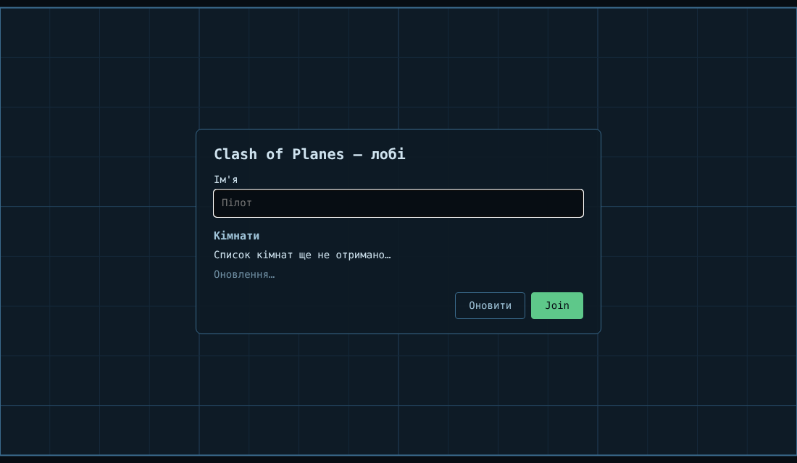 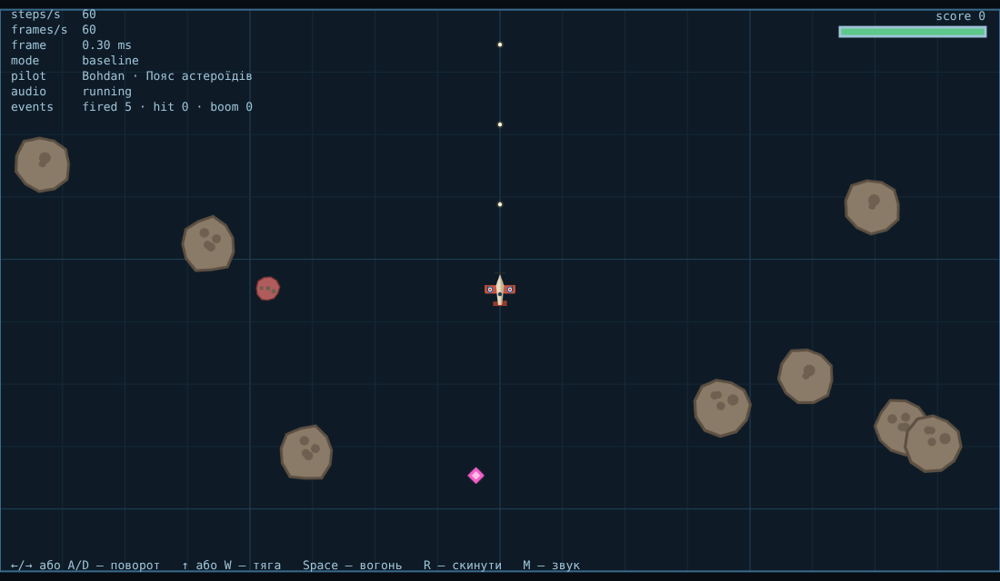

### Пайплайн ассетів

```txt
manifest.json ──loadManifest──► { assets: [{ id, type, url, size, optional? }] }
                                      │  loadAll: усі entries одночасно, Promise.all
          ┌───────────────┬───────────┴───────┬────────────────┐
     loadJson         loadImage           loadAudio          (type → loader)
          └──────────┬────┴───────────────────┘
                fetchBytes(url, { signal, onBytes, onRetry, timeoutMs, retries })
                     │  withRetry: на кожну спробу AbortSignal.any([signal, AbortSignal.timeout(ms)])
                     │  res.ok? → ні: HttpError(status)
                     │  for await (const chunk of chunksOf(res.body)) → onBytes(loaded, total)
                fetchJson = fetchBytes + JSON.parse (SyntaxError → ParseError)
```

- **Єдиний `fetchJson`** (`src/net/http.js`): ним користуються і `loadJson`, і `loadManifest`, і лобі. `ok` перевіряється в одному
  місці (`fetchBytes`), тому `404` ніколи не дійде до `JSON.parse` чи до декодера зображення як «дані».
- **Кожен loader приймає `AbortSignal`.** Сигнал проходить у `fetch`, у читання тіла і в декодування (`abortable(...)` для
  `img.onload` і `decodeAudioData`, які самі сигналу не приймають).
- **Retry з exponential backoff + full jitter:** затримка = `random() · min(cap, base · 2^n)`, `base = 250 мс`, `cap = 4 с`.
  Jitter потрібен, щоб клієнти, які впали одночасно (наприклад, після перезапуску сервера), не повторювали запити теж одночасно.

  | Помилка                                | Повтор? | Чому                                                                      |
  | -------------------------------------- | ------- | ------------------------------------------------------------------------- |
  | `HttpError` 4xx (404, 403, 429…)       | ні      | запит сам по собі неправильний, повтор дасть ту саму відповідь            |
  | `HttpError` 5xx                        | так     | сервер може бути тимчасово перевантажений                                 |
  | `TimeoutError` (таймаут однієї спроби) | так     | мережа могла «підвиснути»; кожна спроба має власний `AbortSignal.timeout` |
  | `TypeError` від `fetch`                | так     | так `fetch` повідомляє про обрив мережі                                   |
  | `AbortError` (гравець скасував)        | ні      | скасування — це рішення, а не збій; перериває навіть паузу backoff        |
  | `ParseError` (битий JSON)              | ні      | той самий файл буде так само битим                                        |

  429 теж не повторюється, бо лаба вимагає «без ретраю на 4xx». У реальному клієнті 429 варто повторювати з урахуванням `Retry-After`.

- **`loadAll` через `Promise.all`** (`src/assets/loadAll.js`). Обов'язкові ассети (`config/game.json`) і необов'язкові
  (`optional: true` — спрайти, атлас, звуки) обробляються по-різному:
  - необов'язковий файл, що впав, перетворюється на `null` усередині власного `.catch`. `Promise.all` про це не дізнається,
    а гра бере запасний варіант: векторні фігури з Lab 1–2 замість спрайтів, тишу замість звуку;
  - обов'язковий файл, що впав, відхиляє `Promise.all`. Сам `Promise.all` **нічого не скасовує**: інші запити тривали б
    далі. Тому `loadAll` тримає власний `AbortController`, зв'язаний із сигналом гравця через `AbortSignal.any`, і перериває ним
    сусідні завантаження (fail-fast; видно на скриншоті «битий JSON» нижче: два звуки позначені «Скасовано: "config" не завантажився»).
- **Гра стартує лише після `await loadAll`:** `main()` спочатку виконує `await loadUntilReady()` і тільки потім створює лобі й світ.

#### Sequential `await` vs concurrent `Promise.all`

`/?bench&latency=N` (`src/lab3/bench.js`) завантажує ті самі 6 файлів (≈122 KB) двома способами: `loadSequential` (`for…of` +
`await` на кожному файлі) і `loadAll` (усі одразу + `Promise.all`). Кожен прогін має унікальний query, щоб HTTP-кеш не впливав
на результат. `latency` — це затримка, яку dev-сервер додає до **кожної** відповіді (`?delay=`): так локальна мережа поводиться
як віддалений сервер. 5 прогонів, у таблиці медіана.

Умови: headless Chromium 141, Linux, `vite` dev-сервер (HTTP/1.1), та сама машина.

| Затримка на файл | Sequential, мс | Concurrent, мс | Різниця |
| ---------------- | -------------- | -------------- | ------- |
| 0 мс (localhost) | 25             | 12             | ×2.2    |
| 50 мс            | 336            | 68             | ×4.9    |
| 150 мс           | 941            | 164            | ×5.7    |

Сирі прогони при 150 мс: sequential `949, 943, 941, 939, 940`, concurrent `164, 162, 167, 165, 162`.

- Послідовно час ≈ **сума**: 6 × (150 + ~7) ≈ 941 мс. Кожен `await` чекає завершення попереднього файлу, хоча файли
  між собою не залежать.
- Конкурентно час ≈ **максимум**: 150 мс затримки + найдовший окремий файл (`explode.wav`, 78 KB, його ще й треба декодувати) ≈ 164 мс.
- Зі збільшенням затримки множник прямує до кількості файлів (6). На localhost без затримки виграш лише ×2.2: тут
  основний час іде на розбір і декодування, а не на очікування мережі.
- Обмеження чесності: штучна затримка не обмежує пропускну здатність. На вузькому каналі паралельні файли ділять смугу, тож
  виграш буде меншим. Ще одне: браузер відкриває до 6 з'єднань HTTP/1.1 на хост. Файлів у нас рівно 6, тому всі йдуть
  паралельно, а сьомий уже чекав би в черзі.

### Спрайти й звук

- **Спрайтшит** — один `sheet.png` (768×320) + атлас `sheet.json`. Кожен кадр має прямокутник у шиті, точку опори (pivot)
  і `r` — радіус зіткнення в пікселях шита. `SpriteSheet.draw(ctx, name, x, y, { angle, radius })` масштабує кадр так, що `r`
  збігається з радіусом сутності, тож один кадр астероїда годиться для будь-якого розміру. Кадри малюються з подвійною
  роздільністю (`pxPerUnit: 2`) і не розмиваються на HiDPI. Корабель має 3 кадри (без тяги + 2 кадри полум'я, що чергуються),
  астероїд — 3 варіанти + червоний «мисливець». Картинки згенеровано процедурно (`scripts/gen-assets.js`, власний
  мінімальний растеризатор + PNG-кодер на `node:zlib`). У репозиторії немає графіки невідомого походження, і `npm run assets`
  відтворює ті самі файли байт у байт.
- **Звук через Web Audio** (`src/audio/audio.js`). Браузер не дозволяє запускати звук без жесту користувача (autoplay
  policy): `AudioContext`, створений до жесту, лишається у стані `suspended`. Тому:
  - буфери **декодуються під час завантаження** через `OfflineAudioContext`, якому жест не потрібен. `AudioBuffer` не
    прив'язаний до контексту, що його декодував, тому той самий буфер потім грає в «живому» контексті;
  - сам `AudioContext` створюється в першому обробнику `pointerdown`/`keydown`. На практиці це клік по «Join» у лобі, тож у грі
    звук уже працює. HUD показує стан (`audio running` / `locked` / `muted`);
  - кожен звук — це новий `AudioBufferSourceNode` → `GainNode` → master gain з невеликим випадковим `detune`, щоб серія
    пострілів не звучала однаково.

### Шина подій: симуляція не знає про звук і HUD

`src/sim/events.js`: `class EventBus extends EventTarget` з методом `emit(type, detail)` → `dispatchEvent(new CustomEvent(type, { detail }))`.
`World` отримує шину в конструкторі (`new World({ events: bus })`). `Ship.fire` надсилає `"fired"`, розв'язання зіткнень —
`"hit"`, `spawnExplosion` — `"exploded"`. Підписуються ззовні:

```txt
sim/ship.js, sim/world.js ── emit ──►  bus (EventTarget)  ──►  audio/audio.js   (звук)
                                                          └──►  ui/hudFeed.js    (лічильники + стрічка подій у HUD)
```

Усі `import` у `src/sim/` (крім тестів) ведуть лише в `./…` всередині `sim/` (перевірка: `grep -h "^import" src/sim/*.js`). Симуляція
не імпортує ні `audio.js`, ні HUD. `EventTarget` і `CustomEvent`
є і в Node, тому тести симуляції (`src/sim/events.test.js`) працюють без DOM. Важливо: `dispatchEvent` **синхронний**
(див. головоломку 5). Слухачі виконуються всередині кроку симуляції, тому вони мають бути дешевими: запустити звук,
збільшити лічильник. Окремо зауважу: виняток у слухачі `EventTarget` не перериває `dispatchEvent`, браузер просто
повідомляє про нього, тож зламаний звук не зупинить фізику.

### Лобі

- **`class Lobby extends EventTarget`** (`src/lobby/lobby.js`) — лише логіка, без DOM. Події: `"rooms"`, `"status"`, `"join"`.
  `src/lobby/lobbyView.js` — окремий DOM-модуль: будує форму, слухає події лобі, викликає `lobby.join()` / `lobby.refresh()`.
  Усі підписки в'ю мають `{ signal }`, тому `unmount()` знімає їх одним `abort()`.
- **Опитування по інтервалу, поки лобі видиме:** `for await (const tick of ticks(intervalMs, signal))`, де `ticks` — асинхронний
  генератор у `src/async.js`. На відміну від `setInterval`, наступна пауза починається лише **після** відповіді, тож повільний
  сервер не накопичить купу паралельних запитів. Коли вкладка прихована (`visibilityState === "hidden"`), тики пропускаються,
  а після повернення список одразу оновлюється.
- **`AbortSignal.timeout` на кожен запит:** `AbortSignal.any([stopSignal, AbortSignal.timeout(2500)])`. Таймаут перетворюється
  на рядок статусу «Сервер не відповів за 2.5 с. Повтор автоматично». Останній отриманий список при цьому лишається на екрані.
- **Abort, щойно гравець пішов:** `join()` і `stop()` викликають `abort()` на контролері лобі. Це зупиняє цикл тиків
  (`sleep` між тиками відхиляється) і скасовує запит, що саме виконується. Таке скасування не показується як помилка
  (тест `stop() aborts the request in flight, silently`).
- **`/api/rooms`** повертає 4 кімнати з `rooms.json`. Сервер щоразу трохи змінює кількість гравців, тому видно, що список
  справді оновлюється. Повна кімната (`4/4`) вимкнена, ім'я перевіряється (1–16 символів) і запам'ятовується в `localStorage`.

### Головоломки порядку мікрозадача / задача

Перевірено двома способами: `/?puzzles` запускає всі п'ять у браузері й порівнює з очікуваним виводом (у Chromium збіглися всі 5,
у трьох запусках поспіль), а `src/lab3/puzzles.test.js` перевіряє 1, 2, 3 і 5 у Node (там немає `requestAnimationFrame`).
У файлі замість `console.log` стоїть `log`, щоб вивід можна було зібрати.

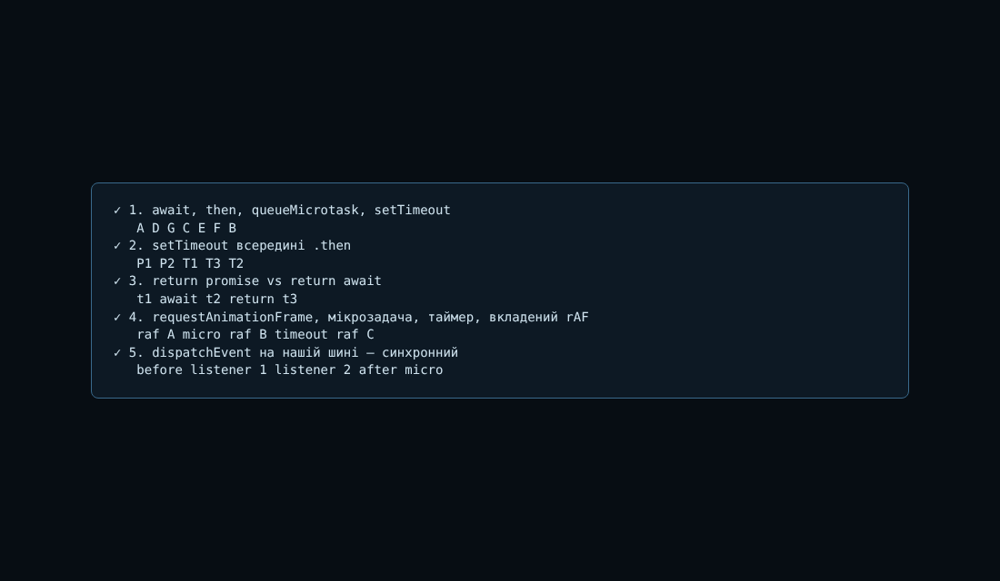

**1. `await` проти `.then`, `queueMicrotask` і `setTimeout`**

```js
console.log("A");
setTimeout(() => console.log("B"), 0);
Promise.resolve().then(() => console.log("C"));
(async () => {
  console.log("D");
  await null;
  console.log("E");
})();
queueMicrotask(() => console.log("F"));
console.log("G");
```

Вивід: `A D G C E F B`. Тіло async-функції до першого `await` виконується синхронно (`D`). Решта функції після `await` стає
мікрозадачею, у черзі вона йде між `C` і `F` у порядку постановки. `B` — задача, тому вона виконується після всіх мікрозадач.

**2. `setTimeout` всередині `.then`**

```js
setTimeout(() => console.log("T1"), 0);
Promise.resolve()
  .then(() => {
    console.log("P1");
    setTimeout(() => console.log("T2"), 0);
  })
  .then(() => console.log("P2"));
setTimeout(() => console.log("T3"), 0);
```

Вивід: `P1 P2 T1 T3 T2`. Увесь ланцюжок мікрозадач (`P1`, `P2`) виконується до першої задачі. `T2` ставиться в чергу задач
лише під час `P1`, тобто після `T1` і `T3`, які вже стоять у черзі з синхронного коду.

**3. `return promise` проти `return await`**

```js
async function viaReturn() {
  return Promise.resolve("return");
}
async function viaAwait() {
  return await Promise.resolve("await");
}
viaReturn().then(console.log);
viaAwait().then(console.log);
Promise.resolve()
  .then(() => console.log("t1"))
  .then(() => console.log("t2"))
  .then(() => console.log("t3"));
```

Вивід: `t1 await t2 return t3`. `await` на вже виконаному нативному промісі коштує один тік, і `.then` спрацьовує на другому.
Повернення промісу з async-функції потребує ще двох тіків (`NewPromiseResolveThenableJob` → `then`), тому `"return"`
з'являється аж на третьому тіку, після `t2`.

**4. `requestAnimationFrame`, мікрозадача, таймер і вкладений rAF**

```js
requestAnimationFrame(() => {
  console.log("raf A");
  requestAnimationFrame(() => console.log("raf C"));
  setTimeout(() => console.log("timeout"), 0);
  Promise.resolve().then(() => console.log("micro"));
});
requestAnimationFrame(() => console.log("raf B"));
```

Вивід: `raf A micro raf B timeout raf C`. Після **кожного** rAF-колбека браузер виконує мікрозадачі (`micro` до `raf B`).
Обидва rAF, зареєстровані до кадру, виконуються в одному кадрі, раніше за таймер, поставлений усередині. rAF, зареєстрований
під час кадру, переноситься на **наступний** кадр (~16 мс), а `setTimeout(0)` спрацьовує раніше. Через це в ігровому циклі
Lab 1 `requestAnimationFrame(tick)` усередині `tick` ніколи не виконується двічі за кадр.

**5. `dispatchEvent` на нашій шині — синхронний**

```js
const bus = new EventTarget();
bus.addEventListener("fired", () => {
  console.log("listener 1");
  Promise.resolve().then(() => console.log("micro"));
});
bus.addEventListener("fired", () => console.log("listener 2"));
console.log("before");
bus.dispatchEvent(new CustomEvent("fired"));
console.log("after");
```

Вивід: `before listener 1 listener 2 after micro`. `dispatchEvent`, викликаний зі скрипта, просто синхронно викликає всіх
слухачів. Між ними стек не порожній, тому мікрозадача чекає до кінця всього скрипта. Інакше буває при справжньому кліку
користувача: тоді браузер викликає слухачів сам і виконує мікрозадачі після кожного. Саме тому `emit("fired")` у `Ship.fire`
відпрацьовує до наступного рядка симуляції.

### Галерея збоїв: гра не падає

Кожен збій вмикається параметром URL (`src/assets/faults.js`) і діє **лише на першу спробу завантаження**. Тому «Retry»
показує саме відновлення, а не той самий збій вдруге. Таймаут і `503` імітує dev-сервер (`?delay=`, `?status=`).
Довелося виправити одну річ: Vite на відсутній файл у `/assets/` повертав `index.html` зі статусом **200** (SPA-fallback).
Middleware тепер відповідає чесним `404`, як справжній статичний сервер.

| Збій                         | Як відтворити            | Що відбувається в коді                                                                                                                                                                                   | Результат                                                       |
| ---------------------------- | ------------------------ | -------------------------------------------------------------------------------------------------------------------------------------------------------------------------------------------------------- | --------------------------------------------------------------- |
| 404 спрайта                  | `/?fail=404`             | `HttpError 404`, 4xx не повторюється (рівно 1 запит). Ассет необов'язковий, тож `null`; `createSpriteSheet` повертає `null`, і `draw.js` малює векторні фігури                                           | **гра стартує**; у лобі примітка про векторну графіку           |
| Таймаут мережі               | `/?fail=timeout`         | `config/game.json` відповідає через 10 с. Кожна спроба обривається `AbortSignal.timeout(3000)`, потім 2 повтори з backoff. Ассет обов'язковий, тому `Promise.all` відхиляється (≈10 с, виміряно 9979 мс) | **кнопка Retry**, після неї — лобі                              |
| Abort посеред завантаження   | `/?fail=abort` або `Esc` | `ac.abort()` через `AbortSignal.any` доходить до кожного `fetch`, читання тіла й декодування; всі файли «— скасовано». Скасування не вважається «необов'язковим» збоєм                                   | **кнопка Retry** («Завантаження скасовано»)                     |
| Битий JSON                   | `/?fail=json`            | `JSON.parse` кидає `SyntaxError`, з нього виходить `ParseError` (не повторюється). Конфіг обов'язковий, тому fail-fast `abort()` скасовує сусідні файли                                                  | **кнопка Retry**                                                |
| 503 один раз (бонус)         | `/?fail=flaky`           | кожен файл спершу отримує `503`, тоді `повтор #2` після випадкової паузи                                                                                                                                 | **гра стартує**, рядки «повтор #2» видно на екрані завантаження |
| Таймаут `/api/rooms` (бонус) | `/?fail=rooms-timeout`   | перші два опитування обриває `AbortSignal.timeout(2500)`, лобі показує помилку й опитує далі; третє успішне                                                                                              | **лобі відновлюється саме** (≈11 с від завантаження сторінки)   |

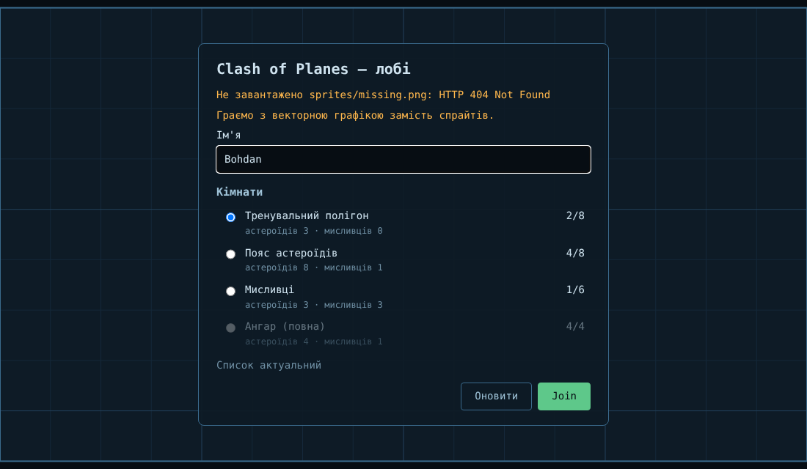 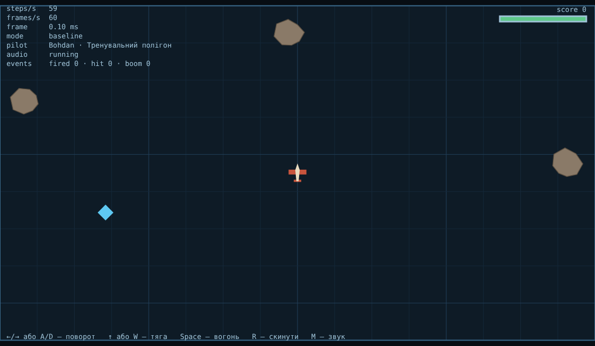

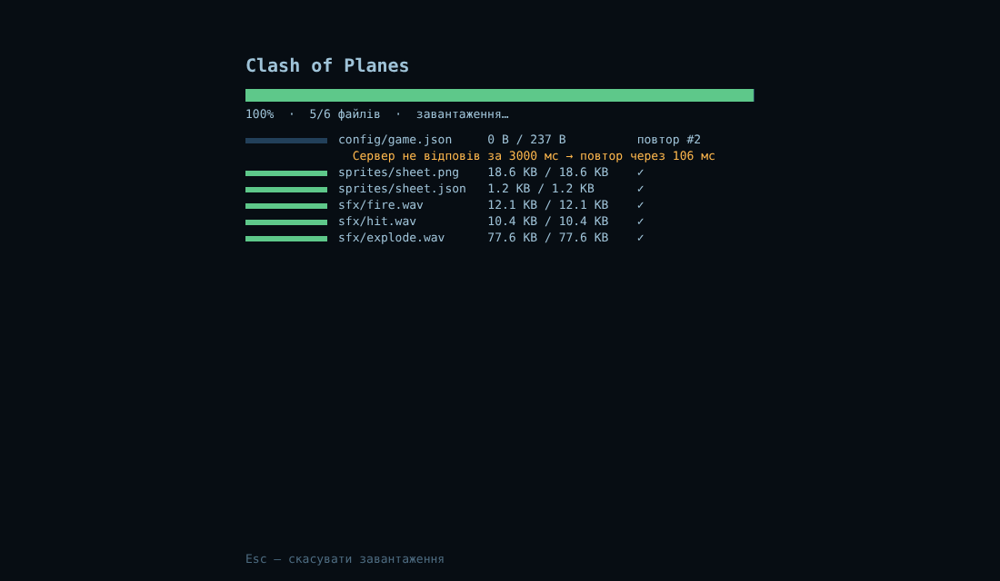 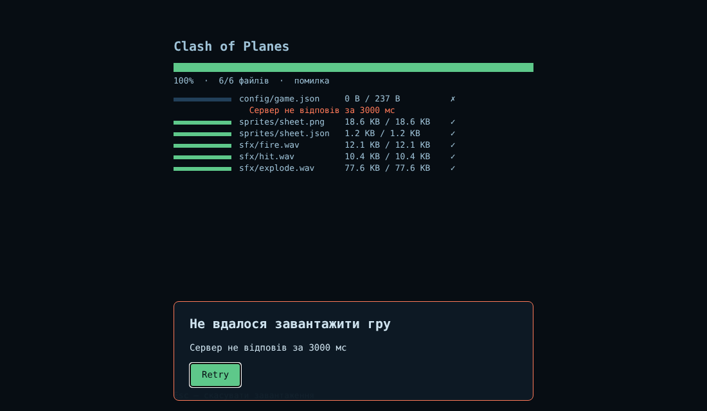

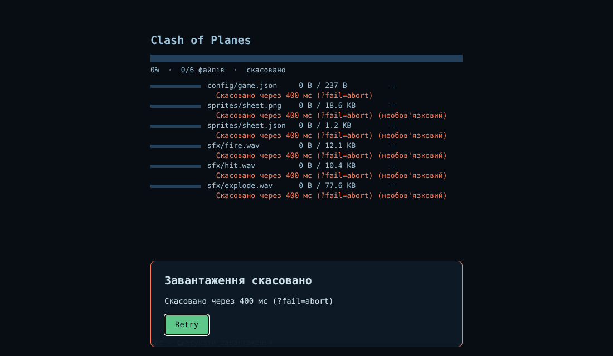 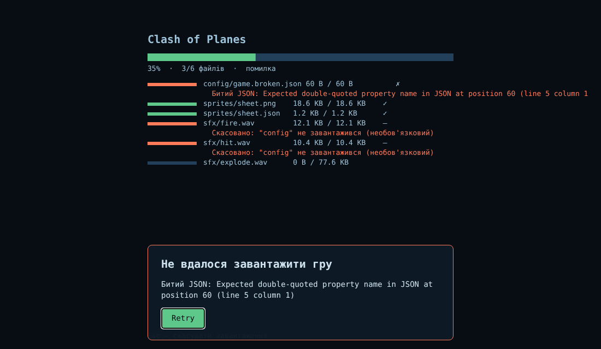

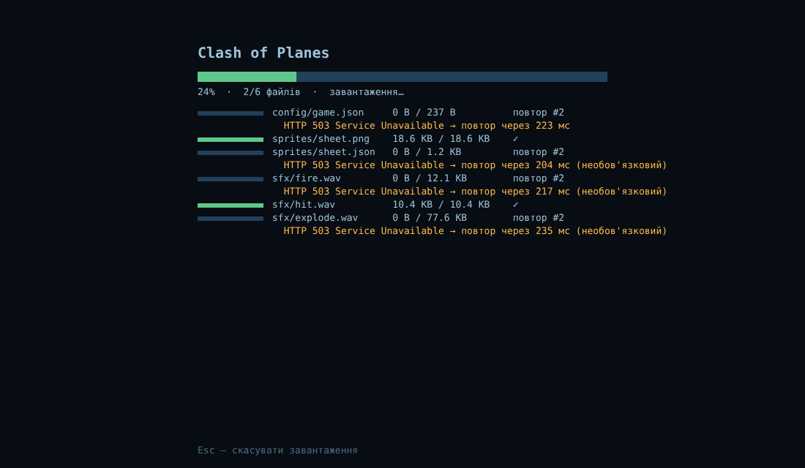 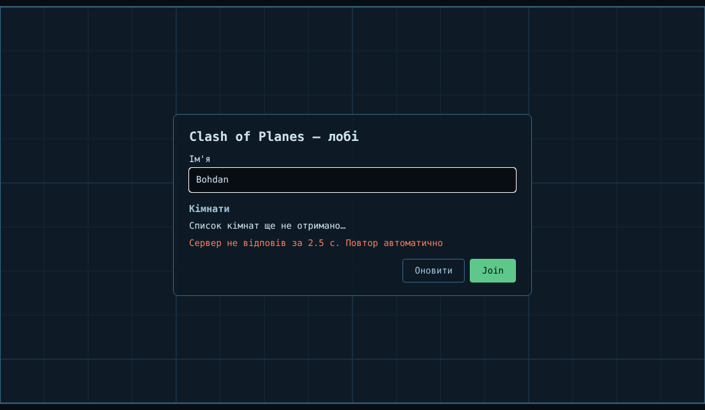

Скриншоти зроблено в headless Chromium (1100×640). Сценарії перевірено автоматично: після «Retry» у кожному випадку з'являється лобі.

### Де які комбінатори і чому

- **`Promise.all`** — у `loadAll`: потрібні всі результати, порядок відповідає маніфесту, і першу фатальну помилку треба
  отримати одразу. Необов'язкові ассети перехоплюються до `Promise.all`, тому один битий звук не валить усе.
- **`Promise.allSettled`** дав би той самий результат для необов'язкових файлів, але без fail-fast: на битому конфігу гра чекала б
  найповільніший звук, перш ніж показати Retry. Тому я його не використовую.
- **`Promise.race`** замінений на `AbortSignal.timeout` + `AbortSignal.any`. `race` лише ігнорує запит, що «програв»,
  а сигнал справді його скасовує: з'єднання закривається, байти більше не завантажуються.
- **`Promise.any`** знадобився б для дзеркал (взяти перший успішний із кількох CDN). Тут джерело одне.
- **Колбек → Promise:** `decodeImage` (`img.onload` / `onerror`) і `sleep` (`setTimeout`) у `src/async.js`.
- **Асинхронна ітерація:** `chunksOf(res.body)` (прогрес по байтах) і `ticks()` (опитування лобі) — обидва async-генератори,
  споживаються через `for await`.

### Що я вивчив (Lab 3)

Головне: `async/await` — це не окремий механізм, а синтаксис над тими самими промісами й тією самою чергою мікрозадач.
Це добре видно в головоломці 3: різниця між `return promise` і `return await` — це рівно два зайві тіки мікрозадач, і її можна
порахувати вручну.

Другий висновок: «паралельно» в JS означає «одночасно чекати», а не «одночасно рахувати». `Promise.all` не прискорює жоден
окремий файл, він лише не чекає попередній, перш ніж почати наступний. Тому виграш дорівнює майже кількості файлів при великій
затримці мережі й зовсім невеликий на localhost, де очікування майже немає.

Третій: скасування треба проєктувати явно. Ні `Promise.all`, ні `Promise.race` нічого не скасовують, вони лише перестають
чекати. Справжнє скасування робить тільки `AbortSignal`, протягнутий через усі шари: `fetch`, читання тіла, декодування,
паузу backoff, цикл опитування. І лише так abort від гравця можна відрізнити від збою мережі.

---

## Довідково

Приватні поля (`#hp`, `#cooldown`, `#respawnTimer` у `Ship`; `#id`, `#nextId` у `Entity`) справді
недосяжні ззовні класу — `ship.hp = 9999` кидає `TypeError`, бо в `Ship` оголошено лише `get hp()`, без
сеттера (перевірено тестом у `ship.test.js`). `World` ніколи не чіпає `#hp` напряму: єдиний спосіб вплинути
на нього ззовні — публічні методи `takeDamage()` і `applyPickup()`.
